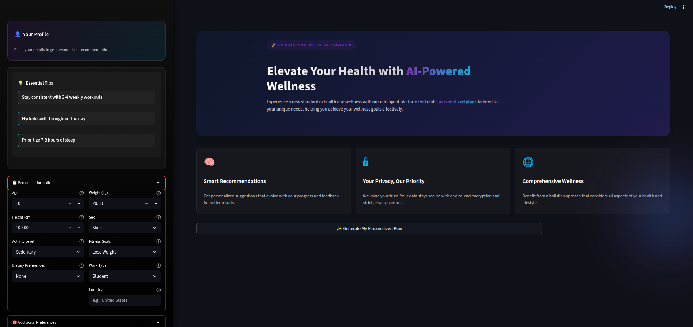
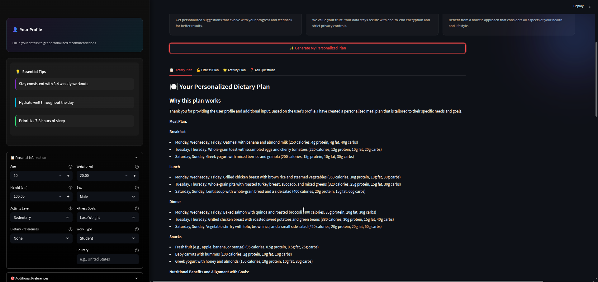

# Wellness Companion

## Problem Statement

In today's fast-paced world, maintaining a healthy lifestyle is challenging due to busy schedules, lack of personalized guidance, and difficulty in tracking multiple health-related activities. Many individuals find it hard to stay motivated and organized while managing exercise, diet, hydration, and sleep.

## Our Solution

Wellness Companion is an AI-powered application designed to simplify health management by generating personalized health plans tailored to individual needs. It helps users track daily activities, set achievable health goals, and monitor progress with insightful visualizations, turning health management into an interactive and engaging experience.

## Project Overview



Wellness Companion integrates several key features to support users in their wellness journey:

- Personalized health plans based on user-specific data such as age, weight, health conditions, and fitness goals.
- Daily tracking of exercise, diet, hydration, and sleep patterns.
- Goal setting and management tools to help users stay on track.
- Progress monitoring through charts and reports to visualize improvements and areas needing attention.

## Technical Implementation

### Core Technologies

- **Frontend:** Streamlit for an interactive and responsive web interface.
- **Backend:** Python with FastAPI to handle API requests.
- **AI/ML:** Utilizes machine learning models for plan generation and progress analysis.
- **Data Storage:** Efficient storage and retrieval of user data and health plans.

### System Architecture



## Installation

### Prerequisites

- Python 3.7 or higher
- pip package manager

### Steps

1. Clone the repository:

   ```bash
   git clone <repository-url>
   ```

2. Navigate to the project directory:

   ```bash
   cd wellness-companion
   ```

3. Install dependencies:

   ```bash
   pip install -r requirements.txt
   ```

## Usage

Start the application by running:

```bash
python app.py
```

Follow the prompts to create your profile, generate a health plan, log daily activities, and track your progress.

## Project Structure

```
Wellness Companion/
├── app.py                # Application entry point
├── requirements.txt       # Python dependencies
├── README.md              # Project documentation
├── agents/                # Agent modules
├── components/            # UI components
├── config/                # Configuration files
├── models/                # Model definitions
├── utils/                 # Utility functions
└── static/                # Static assets
```

## Use Cases

- **For Users:**
  - Generate personalized health plans
  - Set and manage health goals

## Development Workflow

- Create feature branches from the main branch.
- Write tests for new features.
- Run linters and formatters before committing.
- Use pytest for running tests:

  ```bash
  python -m pytest tests/
  ```

- Automated deployment pipelines can be set up using GitHub Actions or similar CI/CD tools.

## License

This project is licensed under the MIT License. See the LICENSE file for details.

## Contact

For questions, suggestions, or feedback, please contact Vishal Rathod at vr3204917@gmail.com.

We welcome contributions and community involvement to make Health Planner better.
